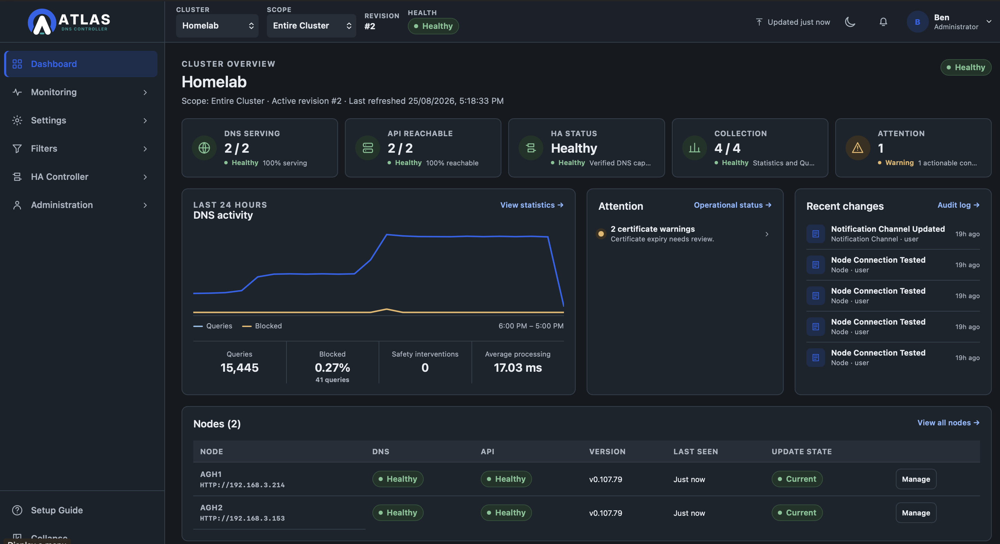
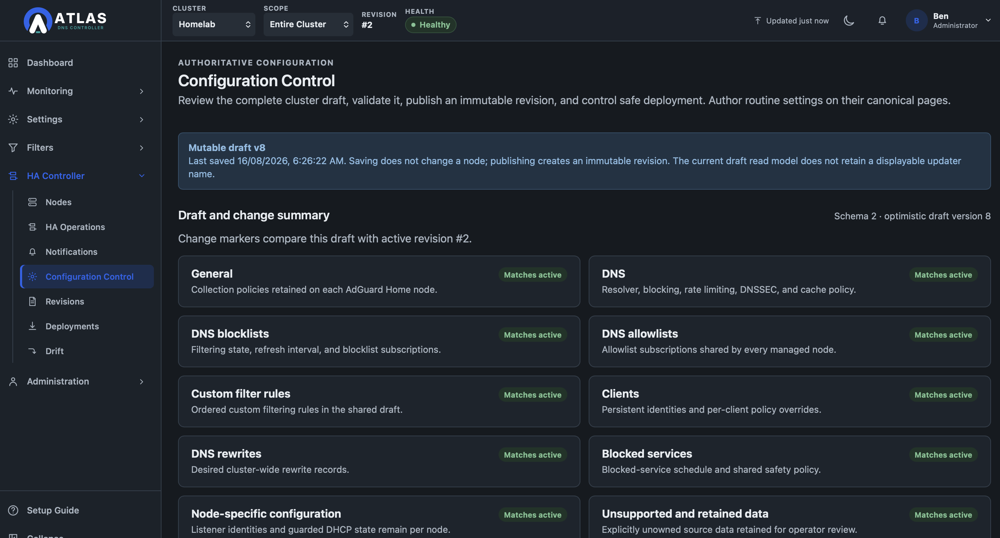
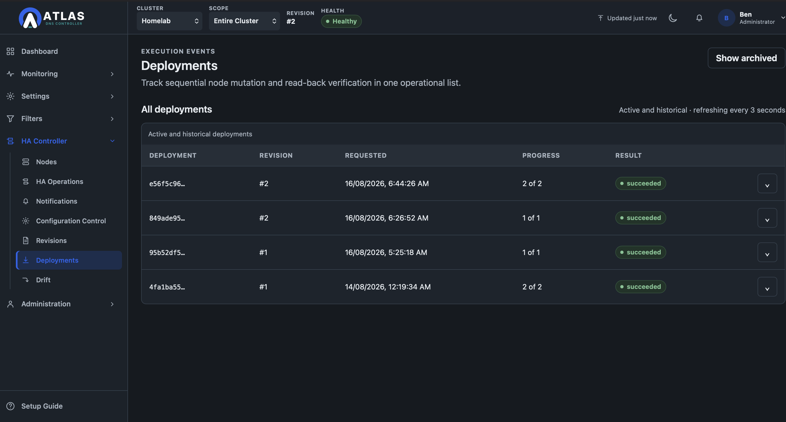

<p align="center">
  <picture>
    <source media="(prefers-color-scheme: dark)" srcset="web/public/branding/atlas-dns-lockup-dark.svg">
    <source media="(prefers-color-scheme: light)" srcset="web/public/branding/atlas-dns-lockup-light.svg">
    
  </picture>
</p>

Atlas DNS Controller is a management plane for multiple
AdGuard Home nodes. It gives homelab users what they have always wanted, High Availablity Adguard Home with ability to deploy, rollback, and visibility accross multiple nodes in a single dashboard. Atlas DNS Controller provides one desired configuration, verified
deployment, drift detection, immutable revision history, aggregated visibility,
and safe lifecycle coordination while remaining outside the DNS request path.

AdGuard Home nodes continue answering DNS with their last applied configuration
if Atlas DNS Controller or PostgreSQL is unavailable.

> Atlas DNS Controller is an independent project. It is not an official AdGuard
> product and is not endorsed by AdGuard Software Ltd.

<p align="center">
  
</p>

## Capabilities

- Shared desired configuration with explicit node-specific boundaries.
- Immutable revisions, semantic comparison, sequential verified deployment,
  rollback, drift detection, and reconciliation policies.
- Node inventory, version/capability awareness, UDP/TCP DNS health,
  maintenance safety, DHCP ownership checks, and guided node upgrades.
- Node-attributed cluster Statistics and centrally retained Query Log search.
- Operational Status, audit history, encrypted webhook administration, and
  bounded data retention.
- Multiple local administrators, encrypted credentials, passphrase-encrypted
  backups, offline recovery, update awareness, and first-run guidance.
- Accessible responsive System/Light/Dark interface and installable PWA
  metadata.

The [feature catalogue](docs/reference/features.md) is the authoritative current
capability and reference.

## Configuration Control

Atlas DNS Controller separates editing, publishing and deployment so configuration changes remain controlled, auditable and recoverable.

<table>
  <tr>
    <td align="center">
      <a href="docs/images/atlas-dns-configcontrol.png">
        
      </a>
    </td>
    <td align="center">
      <a href="docs/images/atlas-dns-revisions.png">
        
      </a>
    </td>
    <td align="center">
      <a href="docs/images/atlas-dns-deployments.png">
        
      </a>
    </td>
  </tr>
  <tr>
    <td align="center">
      <strong>Configuration Control</strong><br>
      Manage the desired DNS configuration from one place.
    </td>
    <td align="center">
      <strong>Immutable Revisions</strong><br>
      Publish versioned configuration with a permanent change history.
    </td>
    <td align="center">
      <strong>Verified Deployments</strong><br>
      Validate and deploy configuration safely across every managed node.
    </td>
  </tr>
</table>


## Architecture

```text
Administrator browser
  → Atlas DNS Controller API and workers
      → PostgreSQL 17
      → AdGuard Home administration APIs

DNS clients
  → AdGuard Home nodes directly
```

Atlas DNS Controller never proxies normal DNS, requires no node agent, and does
not execute remote host upgrades. Configuration follows:

```text
draft → validation → immutable revision → deployment → verification
      → active revision → drift detection/reconciliation
```

See the [architecture overview](docs/architecture/architecture.md) and
[security guide](docs/security/security.md).

## Install Atlas DNS Controller

Supported production installation methods consume prebuilt release artefacts.
Operators do not need Go, Node.js, npm, Make, or a source checkout.

| Method | Canonical guide | Distribution |
|---|---|---|
| Docker Compose | [Docker guide](docs/getting-started/docker.md) | Public multi-platform GHCR image |
| Portainer Stack | [Portainer guide](docs/getting-started/portainer.md) | Same production Compose and GHCR image |
| Debian 13/systemd | [Native guide](docs/getting-started/native-systemd.md) | Verified GitHub Release archive |
| Manual Linux archive | [Manual release guide](docs/getting-started/manual-release.md) | Verified amd64/arm64 archive |
| Source/development | [Local development](docs/development/local-development.md) | Contributor/custom build only |

The production Docker workflow is:

```bash
docker compose pull
docker compose up -d
```

The production Compose file has no Atlas source `build:` section. Developers
who intentionally build locally use `compose.dev.yaml`.

## Supported baseline

- AdGuard Home v0.107.52 and later patches in the v0.107 API generation,
  subject to explicit capabilities. v0.107.78 and v0.107.79 are release-tested;
  newer v0.107 patches are provisionally compatible after contract validation.
- PostgreSQL 17.
- Debian 13 with systemd.
- Docker Engine with Compose v2 and Portainer Stack deployment.
- GHCR images and native archives for Linux amd64 and arm64.
- Current Chromium baseline; current Firefox and Safari/iOS as documented in the
  [compatibility matrix](docs/operations/compatibility-matrix.md).

Other AdGuard Home API generations remain unknown and managed writes are
blocked until reviewed.

## Security and recovery

Deploy behind HTTPS and treat Atlas DNS Controller as a privileged management
system. Browser mutations require an authenticated administrator and CSRF token;
node credentials and webhook destinations are encrypted and write-only; the
container is unprivileged and has no Docker socket.

Backups use the Atlas `.atlasdnsbackup` format and require a protected
passphrase. Restore is offline into a new empty database. See [backup and restore](docs/operations/backup-and-restore.md) and [SECURITY.md](SECURITY.md).

## Upgrades and support

Release 1.0.0 is the stable database baseline for supported 1.x upgrades. The
1.0.1 patch is schema-neutral; 1.0.2 appends the notification-history migration.
Database migrations are ordered, checksum-verified, append-only, and
forward-only unless a release explicitly documents otherwise.

Community support is best-effort with no SLA. Read the
[support and deprecation policy](docs/product/support-and-deprecation-policy.md),
[operations runbook](docs/operations/runbook.md), and [changelog](CHANGELOG.md).

## Documentation

- [Documentation home](docs/README.md)
- [User guide](docs/user-guide/overview.md)
- [Administration guide](docs/administration/administration.md)
- [Operations runbook](docs/operations/runbook.md)
- [API reference](docs/api/controller-api.md)
- [Architecture decisions](docs/decisions/README.md)
- [Roadmap](docs/roadmap/roadmap.md)

## Contributing

Read [CONTRIBUTING.md](CONTRIBUTING.md), [AGENTS.md](AGENTS.md), and the
[development guide](docs/development/local-development.md). Contributions must
preserve DNS-path independence, immutable revision/audit evidence, secret
handling, and documented failure behavior.

## Licence

Atlas DNS Controller is licensed under the Business Source License 1.1
(`BUSL-1.1`). Non-commercial personal and homelab use is granted; commercial
hosting or resale is prohibited. Each version changes to Apache License 2.0 on
August 12, 2032 or its earlier fourth-anniversary trigger under BUSL-1.1. See
[LICENSE](LICENSE) for the controlling terms.
