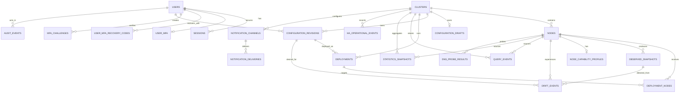

# Database ERD

This is a compact relationship view of the implemented stable schema. The
[database design](../database/database-design.md) and append-only migrations are
authoritative for columns, constraints, and retention detail.

Immutable desired revisions, mutable drafts, observed snapshots, per-node
deployment results, drift, and operational data remain distinct. Released
migrations are never renamed for cosmetic product changes.
